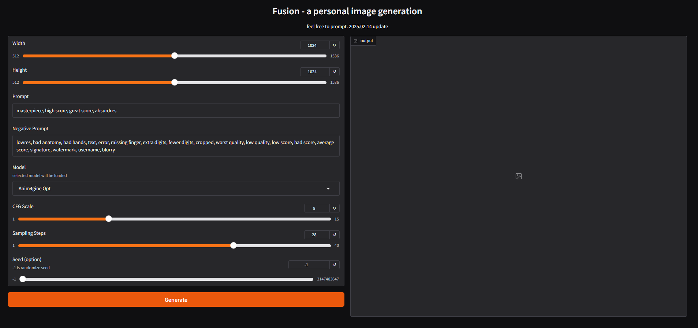

# Fusion

## 概要

Stable Diffusionによる画像生成を行うためのUI、Fusionをリリースしました  
これは、[ANIM4GINE](https://huggingface.co/cagliostrolab/animagine-xl-4.0)と合わせて公開されたSpaces([Gradio demo](https://huggingface.co/spaces/cagliostrolab/animagine-xl-4.0))に感銘を受け、個人的な趣味で作ったUIになります



このインターフェースは数回程度、ちょっと画像生成をするときに使うことを想定して作られました  
従って、[Stable Diffusion Web UI](https://github.com/AUTOMATIC1111/stable-diffusion-webui)や、[ComfyUI](https://github.com/comfyanonymous/ComfyUI)の代替を目指すものではありません  
特徴としては、普段、画像生成をするときに見ていく設定の順番に合わせてコンポーネントを並べております  
本人の感性が優先されたUIとなっております  

## 前提

- Google Colab

## 導入

4ステップで起動できます

```bash
# プロジェクトをColabにコピーします
!git clone https://github.com/educator-art/Fusion

# コピーしたFusionフォルダにカレントディレクトリを変更します
%cd Fusion

# 必要なライブラリをインストールします
!pip install -r requirements.txt

# UIを起動します(httpsから始まるURLをクリックします）
!python app.py
```

※ 初回の画像生成に限りモデルのダウンロードが行われます  
画像生成を行うモデルは[ANIM4GINE](https://huggingface.co/cagliostrolab/animagine-xl-4.0)を使用していますので、モデルのライセンスに関してはそちらをご確認ください  

## ライセンス

 - Apache-2.0 license

## 謝辞

本件の実装にあたってドキュメントやコードを参考にさせて頂きました
この場を借りて感謝を申し上げます

- [cagliostrolab](https://huggingface.co/cagliostrolab) 
- [gradio](https://www.gradio.app/)
- [hugging face](https://huggingface.co/)
- [pytorch](https://pytorch.org/)
- [kohya-ss](https://github.com/kohya-ss/sd-scripts)
